# GITHUB - JENKINS - DOCKER 

## THIS IS A SAMPLE PROJECT TO AUTOMATE THE END-END PROCESS USING GITHUB , JENKINS & DOCKER

## REQUIREMENTS (PRE-INSTALLED)

 * Github
 * Jenkins
 * Docker 
 
## GITHUB BASH :
 
 * Im using the git clone method to simplifiy the steps .
 
 ```
 git clone <repository link>
 ```
 
 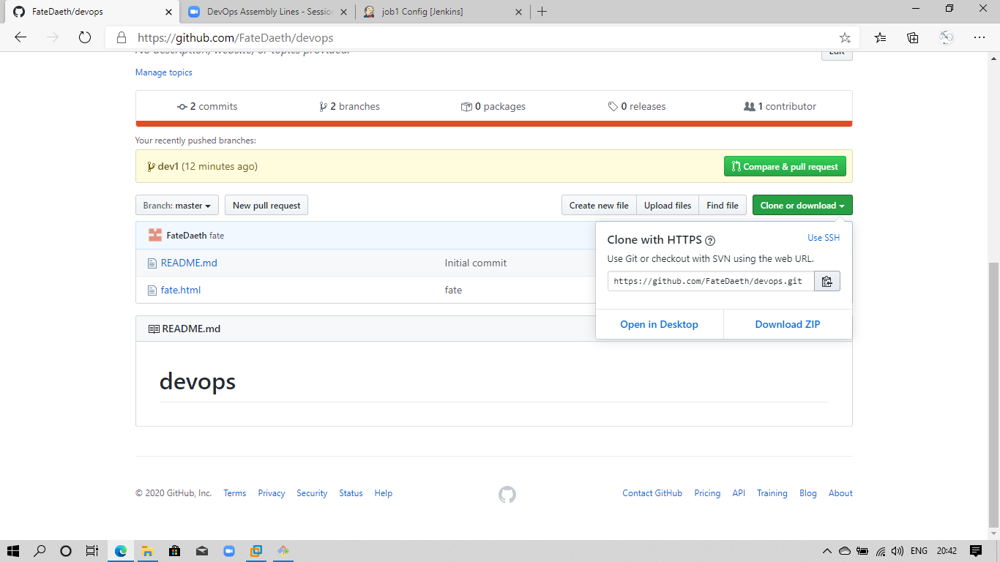
 
 
 * I have used two branch master (created by default) & dev1 (maually created )
 
 * master branch is deployed in the production system (Docker image)
 
 * dev1 branch is deployed in the testing system (Docker image)
 
 * when the job3 run the dev1 branch merges with master and gets deployed to the production system .
 
 
 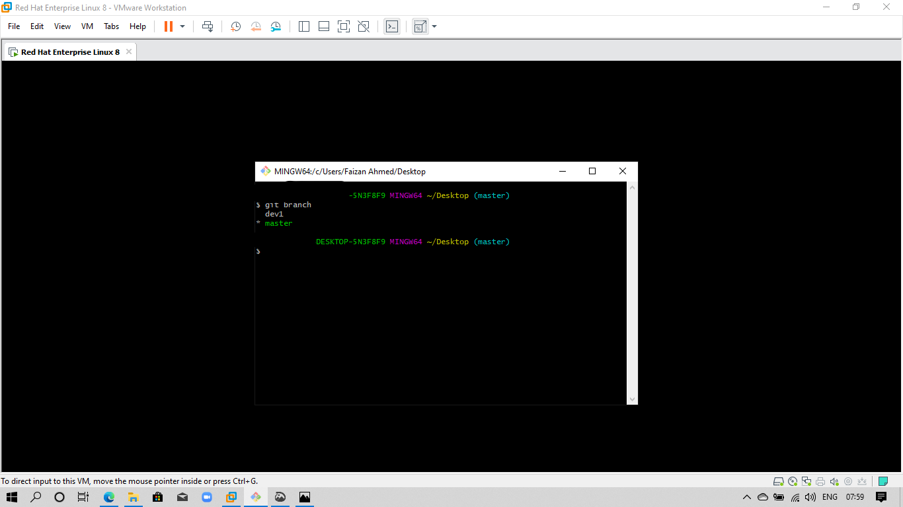
 
 
### CREATING GIT HOOKS POST-COMMIT  
 
 ```
$ notepad .git/hooks/post-commit
``` 

* Paste the below script in the notepad

```
#! bin/bash

git push
```

 Note : The .git/hooks/post-commit is global for the working repository no need of creating it for every branch . 
 
# CREATING THE GIT-WEBHOOKS
 
 ```
 repository setting -> webhooks -> add webhook -> paste the <url/github-webhook/>
 ```
 


## NGROK


* Github-webhooks requires a public ip to push in order to hook jenkins im using ngrok to tunnel to a public ip  

* you have to download the software & run :

```
./ngrok
```

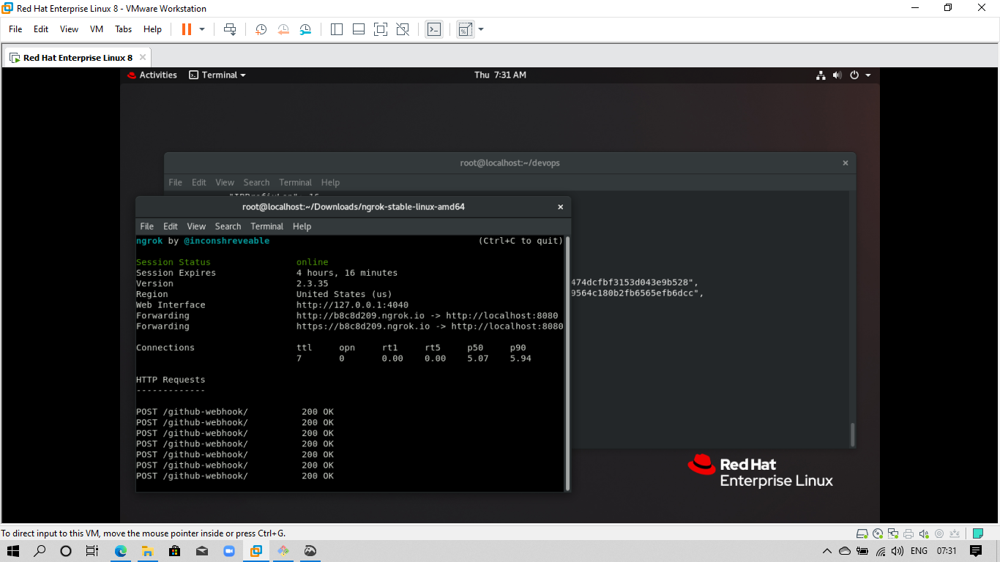


## CONFIGURING THE JENKINS


 * To start the jenkins 
 
 ```
 systemctl start jenkins
 ```
 
 Note : jenkins usually run on port 8080 i.e, ip:8080/
 

* This is the homepage of jenkins
 
 
 
 
 
 

* To create a job click on new item 
 
 
 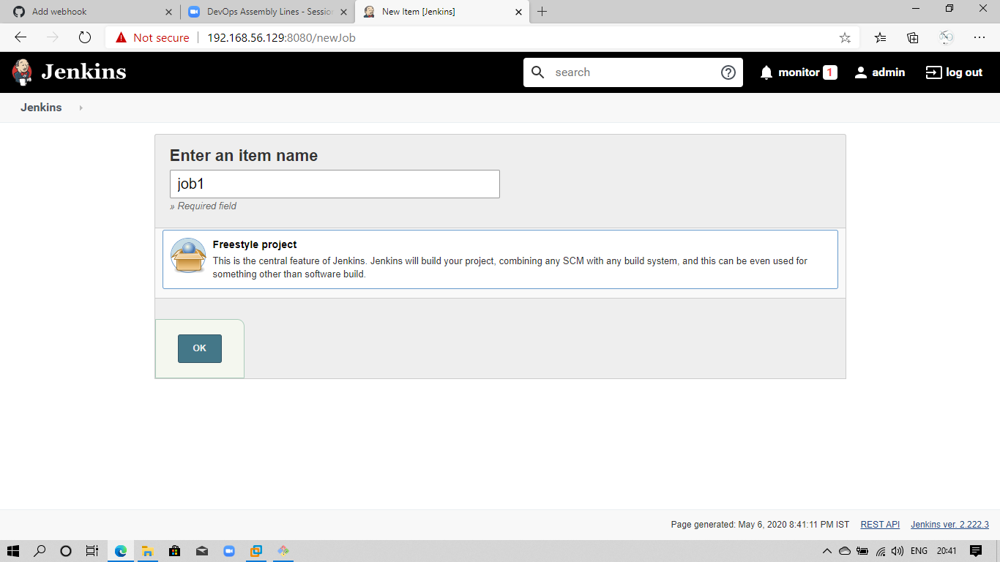
 
 
 
 *Note :make sure to select the freestyle project*
 
 ## JOB1
 
 * Creating the job1 (master) :
 
 
  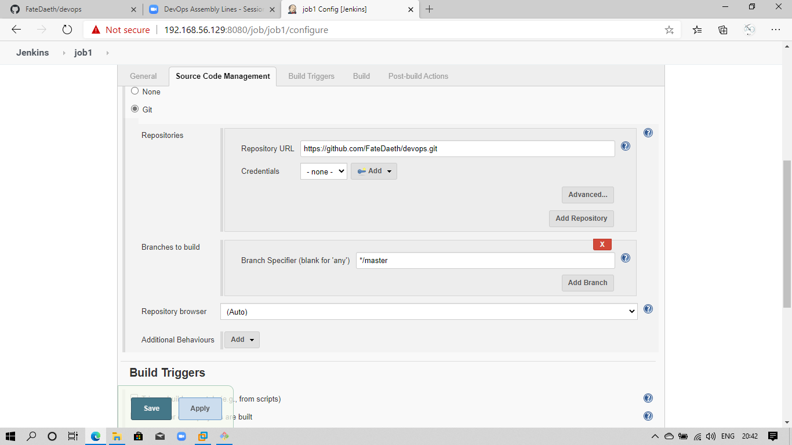
  
  
  
 * make sure to select the -> **triggers -> GitHub hook trigger for GITScm polling**
  
  
  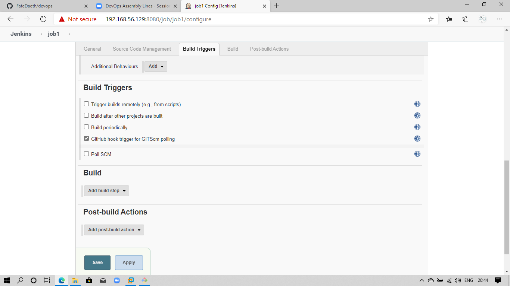
  
  
 **In build -> add build setup -> execute shell**
  
 * Paste this commands in the execute shell
  
  ```
sudo cp * /root/devops/

if sudo docker ps | grep dev
then
echo "already running "
else 
sudo docker run -d -it -v /root/devops:/usr/local/apache2/htdocs/ --name dev httpd
fi
``` 

 ## JOB2
 
 * Creating the job2 (dev1) :
 
 
 
 
 
 * make sure to select the -> **triggers -> GitHub hook trigger for GITScm polling**
 
 
 
 
 
 **In build -> add build setup -> execute shell**
 
 * Paste this commands in the execute shell
 
 ```
sudo cp * /root/devops/

if  sudo docker ps | grep dev1
then
echo "already running "
else 
sudo docker run -d -it  -v /root/devops:/usr/local/apache2/htdocs/ --name dev1 httpd
fi
``` 
Note : if needed can add **-p (any port)** i.e, 8080:80 to tunnel it through the base os ip.

## JOB3
 
* In **source code Management** there is an **Additional Behaviours** in that select the **post merge** 
 
* In the **Branch to merge to** : **master**
 
 
 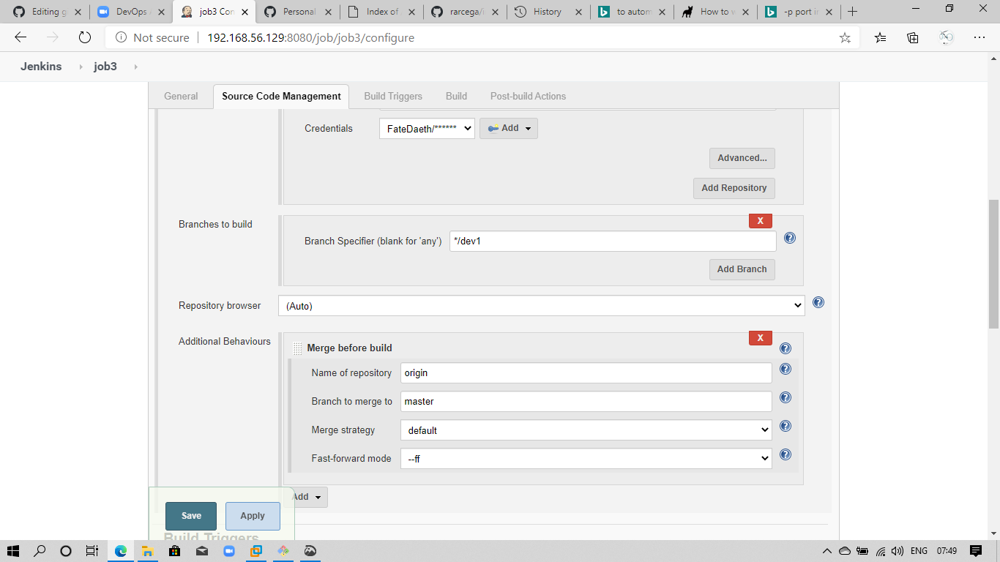
 
 
* Thats it ..Done !!
 
* Apply and Save 
 
## INVALID USERNAME AND PASSWORD  
 
 * you might face an error of invalid username and password 
 
 * To avoid this error create a token and use it a password while merging the branch (job3)
 
 ```
 settings -> Developer settings -> create a personal acess tokens 
 ```

## JENKINS PERMISSION DENIED  

* you might face an error of jenkins permission denied. 

* we grant the jenkins permission to run the commands by modfying sudoers 

```
gedit /etc/sudoers
```

* In the 100th line add this line and save 

```
jenkins   ALL=(ALL)    NOPASSWD:  ALL
```

Note : its bad practice to grand jenkins all permission  


## DOCKER 
 
 * To download the apache webserver image from docker hub .
 ```
 docker pull httpd
 ```
 Note : if no version of the image is given it selects **:latest** as default  

 * The Docker images launched each container has its own dedicated ip adress . 
 
 * To get the container ip adress we can use 
 
 ```
 docker inspect <container name>
 ```
 
 
 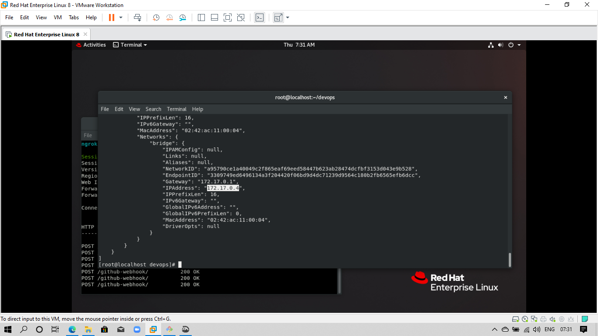
 
 
 
 * The jobs created at background and the webserver is configured 
 
 
 
 
 
 ## OUTPUT :
 
 * Jenkins after all the jobs execute sucessfully 
 
 
 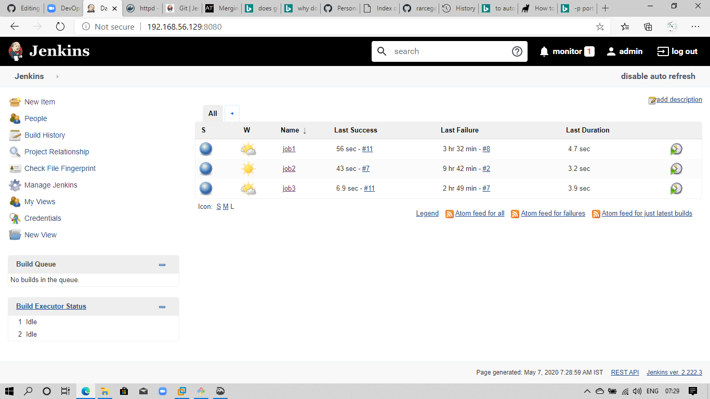
 
 
 * Job1 output with it dedicated server 
 
 
 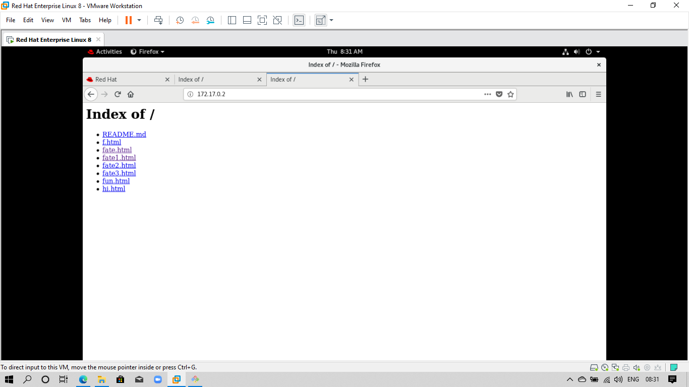
 
 
 * Job2 output with it dedicated server 
 
 
 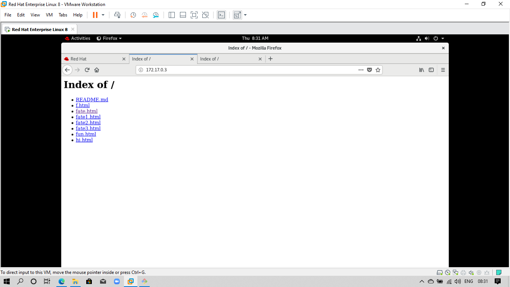
 
 
 * Job3 output with the same server as job1 (production system)
 
 
 
 
 
 
 **Its my first post so kindly fix my errors if there is any !! :)**

